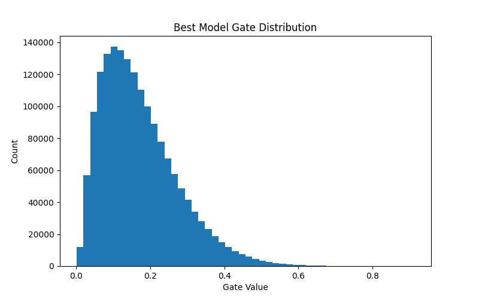

# Self-Pruning Neural Network

A PyTorch implementation of a self-pruning neural network using learnable gate parameters and L1 sparsity regularization on the CIFAR-10 dataset.

---

## 📌 Project Overview

Large neural networks often contain many unnecessary weights, which increase memory usage and computation cost.

This project implements a **self-pruning neural network** that learns to remove less important internal connections during training.

Each weight is paired with a learnable gate value:

- Gate close to **1** → keep connection
- Gate close to **0** → prune connection

This helps create a smaller and more efficient model while maintaining prediction accuracy.

---

## 🚀 Features

- Custom `PrunableLinear` layer
- Learnable gate parameters
- Sigmoid-based gating mechanism
- L1 sparsity regularization
- Automatic pruning during training
- CIFAR-10 image classification
- Accuracy vs Sparsity comparison for multiple lambda values
- Gate distribution visualization

---

## 🛠 Tech Stack

- Python
- PyTorch
- Torchvision
- Matplotlib
- Pandas

---

## 📂 Repository Files

- `self_pruning_network.ipynb` → Full implementation notebook
- `results.csv` → Final results for different lambda values
- `gate_histogram.png` → Distribution of learned gate values

---

## 📊 Results

| Lambda | Accuracy (%) | Sparsity (%) |
|--------|--------------|--------------|
| 0.001  | See CSV File | See CSV File |
| 0.01   | See CSV File | See CSV File |
| 0.05   | See CSV File | See CSV File |

Higher lambda values increase pruning but may reduce model accuracy.

---

## 📈 Gate Distribution



---

## ▶️ How to Run

```bash
pip install torch torchvision matplotlib pandas
